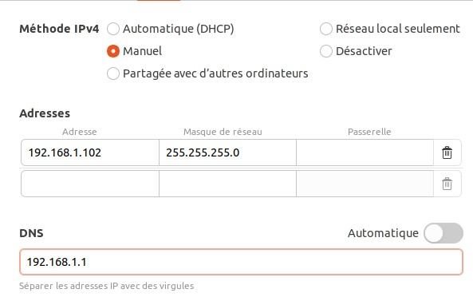
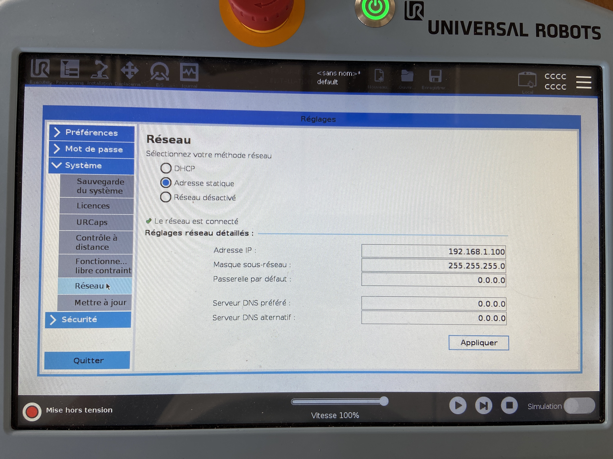
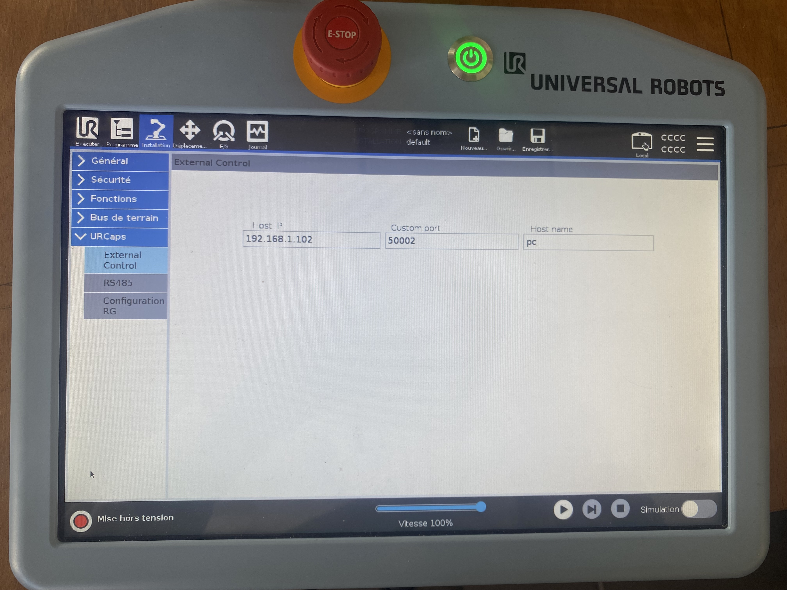

# Manipulation d'un UR3e sous ROS2 Humble

Ce tutoriel concerne l'étude réalisée lors d'un projet universitaire consistant à manipuler un bras industriel grâce à ROS2.
Dans ce tuto nous réaliserons l'installation et utiliserons un robot UR3e sous ROS2. Nous verrons comment utiliser Moveit! mais aussi comment réaliser un premier programme python. Nous avons connecté le robot ainsi que le PC sous Ubuntu 22.04 en Ethernet sur un routeur. 

# Ressources utilisées
- Linux Ubuntu 22.0.4
- ROS2 Humble
- Python 3.10.12
- Drivers UR pour ROS2 Humble
- MoveIt! / Rviz

# Installation de ROS2 Humble
Pour plus de détails sur l'installation, rendez-vous sur le site officiel de ROS2 Humble : 
https://docs.ros.org/en/humble/Installation/Ubuntu-Install-Debs.html

**Définir les paramètres régionaux**
```
locale  # check for UTF-8
sudo apt update && sudo apt install locales
sudo locale-gen en_US en_US.UTF-8
sudo update-locale LC_ALL=en_US.UTF-8 LANG=en_US.UTF-8
export LANG=en_US.UTF-8

locale  # verify settings
```

**Initialiser les sources**
```
sudo apt install software-properties-common
sudo add-apt-repository universe
```
```
sudo apt update && sudo apt install curl -y
sudo curl -sSL https://raw.githubusercontent.com/ros/rosdistro/master/ros.key -o /usr/share/keyrings/ros-archive-keyring.gpg
```
```
echo "deb [arch=$(dpkg --print-architecture) signed-by=/usr/share/keyrings/ros-archive-keyring.gpg] http://packages.ros.org/ros2/ubuntu $(. /etc/os-release && echo $UBUNTU_CODENAME) main" | sudo tee /etc/apt/sources.list.d/ros2.list > /dev/null
```

**Installer les packages ROS 2**
```
sudo apt update
```
```
sudo apt upgrade
```
```
sudo apt install ros-humble-desktop
```
**Lancer ROS**
ROS2 Humble est désormais installé, afin de manipuler ROS il faut le sourcer à chaque nouveau terminal créé grâce à cette commande :
```
source /opt/ros/humble/setup.bash
```


Afin d'éviter de retaper la commande à chaque fois, on peut simplement modifier le fichier .bashrc afin d'exécuter la commande à chaque nouveau terminal automatiquement :
```
cd
gedit .bashrc
```
Un fichier texte va s'ouvrir, rajouter simplement la commande ``source /opt/ros/humble/setup.bash`` tout à la fin de ce fichier. 

# Installation des drivers UR pour ROS2
Plus d'informations sur le github suivant : https://github.com/UniversalRobots/Universal_Robots_ROS2_Driver
Nous utiliserons directement les drivers fournis par Universal Robots afin de contrôler le robot avec ROS2. Nous les installons via cette commande : 
```
sudo apt-get install ros-rolling-ur
```
Cependant, le robot nécessite un module complémentaires (aussi appelé URCaps) permettant d'éxecuter des commandes par contrôle externe (Par adresse IPv4). Installez le fichier [externalcontrol-1.0.5.urcap](externalcontrol-1.0.5.urcap) et mettez-le sur dans clé USB afin de la brancher sur le teachbox du robot. 

Ensuite nous allons installer l'URCaps dans le teach, pour cela allez dans les réglages du robot : 


Allez dans Système > URCaps, et cliquez sur le bouton **+** En bas de la fenêtre :


Puis ouvrez votre fichier externalcontrol-1.0.5.urcap dans la fenêtre qui suit, une fois cela fait attendez que l'installation se termine, on vous proposera de redémarrer le robot afin de finaliser l'installation.


# Configuration des adresses IP du robot et du PC
Une fois redémarré, nous allons attribuer au PC l'adresse IP 192.168.1.102, et celle du robot sera 192.168.1.100 (Vous pouvez choisir d'autres adresses tant qu'elles seront <ins>sur le même réseau</ins>).

**Configurer l'adresse IP du PC**
- Ouvrez les paramètres d'Ubuntu
- Ouvrez les paramètres réseaux d’Ubuntu
- Allez dans les paramètres de la connexion filaire du robot
- Dans l'onglet iPv4, attribuez l'adresse comme ci-dessous :



**Configurer l'adresse IP du Robot**
- Retournez dans les réglages du robot
- Dans l'onglet Système > Réseau, attribuez l'adresse comme ci-dessous :



**Configurer l'IP du contrôle externe (URCaps installé précédemment sur le robot)**
- En haut à gauche, allez dans la section Installation
- Rentrez l'IP du PC (contrôleur externe) comme ci-dessous



Les adresses IP sont bien configurées, vérifiez la connexion entre les deux appareils en faisant un ping vers le robot dans un terminal : 
```
ping 192.168.1.100
```

# Contrôler le robot
Maintenant que tous les préparatifs sont terminés, nous pouvons commencer à utiliser ROS2 pour piloter le robot. Voici les étapes à suivre (1 terminal par commande) :
- Initier la connexion entre le robot et le pc à l'aide de la commande ``ros2 launch ur_robot_driver ur3e.launch.py robot_ip:=192.168.1.100`` (Cette commande est obligatoire afin d'utiliser les suivantes)
- Lancez le programme robot sur le teach (afin de lancer le contrôle externe)
- Contrôler le robot à l'aide de MoveIt! ``ros2 launch ur_moveit_config ur_moveit.launch.py ur_type:=ur3e``

Ca y est, vous êtes capables de déplacer le robot à l'aide de votre PC. Déplacez le robot à l'aide de votre souris, plannifiez et exécutez le déplacement vers la nouvelle position dans l'onglet MotionPlanning

**Programme python** 

Afin de lancer un programme python, il faut s'assurer d'abord que python est installé sur le PC.
```
sudo apt install python3.10
```

